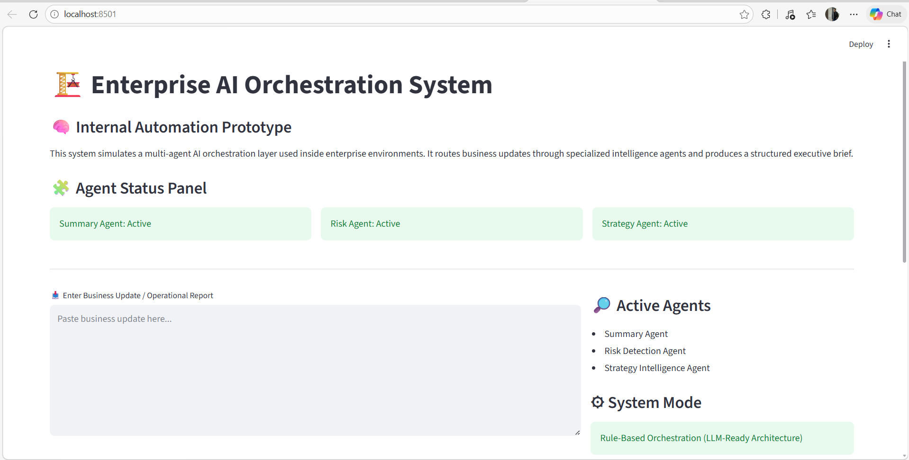
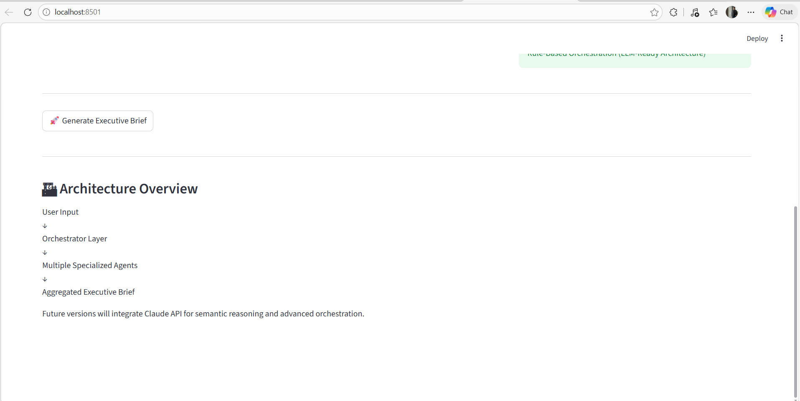
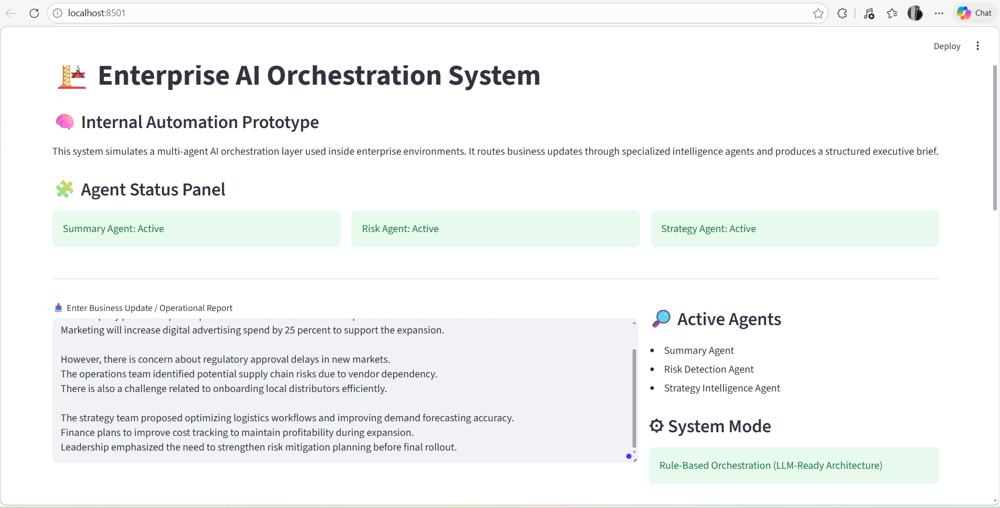
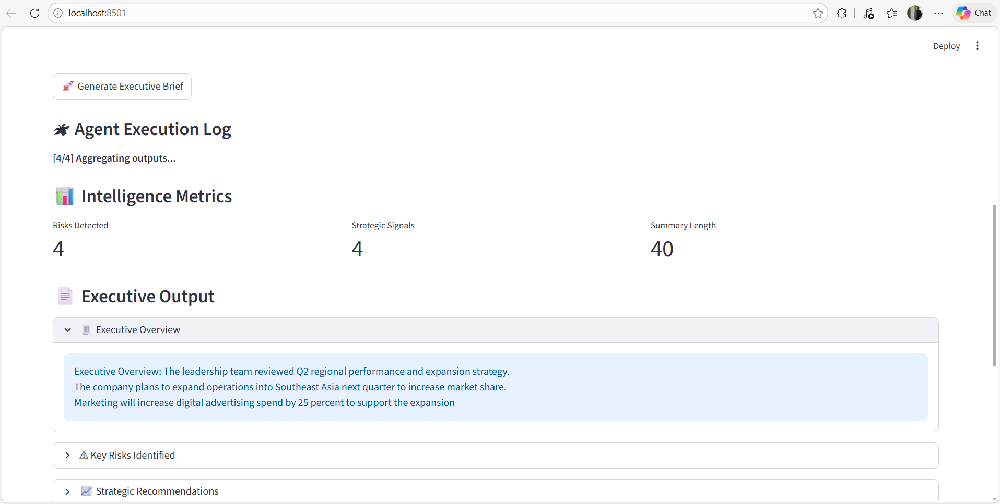
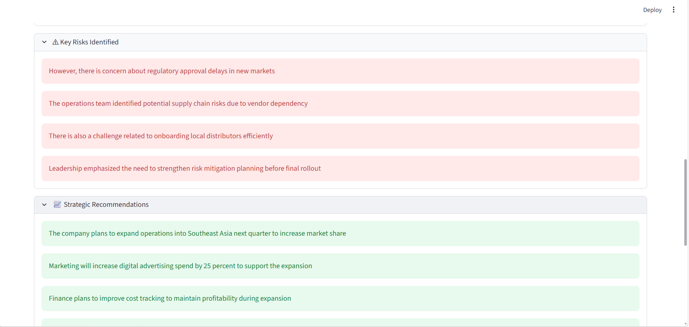
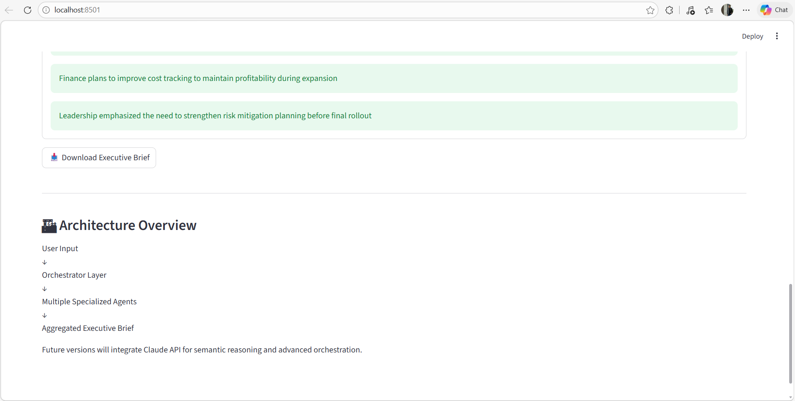
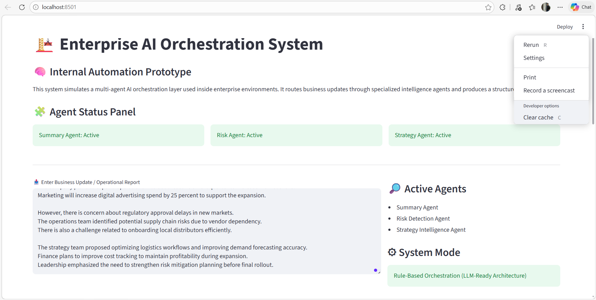
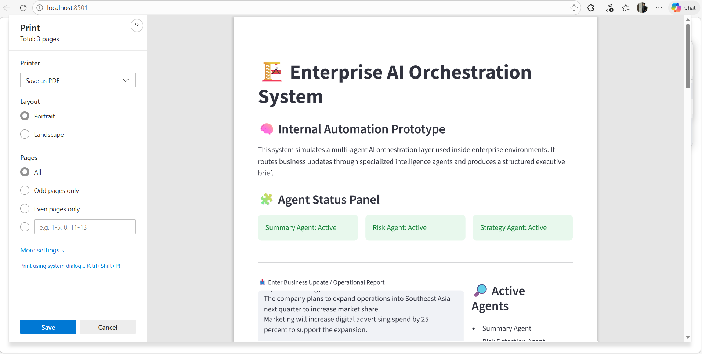
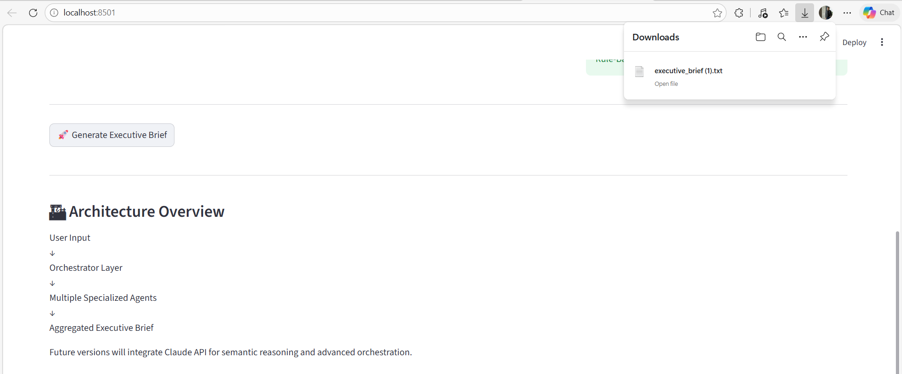

# 🏢 Enterprise AI Orchestration System  
### Multi-Agent Intelligence Control Panel

## Overview

Enterprise AI Orchestrator is a modular multi-agent system prototype designed to simulate internal enterprise AI automation workflows.

The system routes business updates through specialized agents and generates a structured executive brief.

This project demonstrates architecture thinking, workflow routing, structured output generation, and enterprise-style dashboard design.

---

## 🧠 System Architecture

User Input  
↓  
Orchestrator Layer  
↓  
• Summary Agent  
• Risk Detection Agent  
• Strategy Intelligence Agent  
↓  
Aggregation Layer  
↓  
Executive Brief + Intelligence Metrics  

---

## 📸 Demo Preview

### 🏢 Dashboard View



### 🛰 Agent Execution Log





### 📊 Executive Output & Download




---

## 🔍 Features

- Multi-agent routing architecture
- Structured executive output
- Intelligence metrics dashboard
- Executive readiness index
- Expandable analysis sections
- Downloadable executive report
- LLM-ready modular pipeline

---

## 🧩 Agents

### Summary Agent
Extracts high-level executive overview from business updates.

### Risk Agent
Detects operational, regulatory, and strategic risks.

### Strategy Agent
Identifies improvement signals and forward-planning opportunities.

---

## 📊 Intelligence Metrics

The system calculates:
- Risk count
- Strategy signal count
- Summary density
- Executive readiness score

---

## 🚀 Run Locally

```bash
pip install -r requirements.txt
streamlit run app.py
```

---

## 🔮 Future Enhancements

- Claude API integration
- Multi-agent reasoning chains
- Slack integration
- Role-based reporting
- Memory persistence layer

---

## 🎯 Why This Project Matters

This project demonstrates:

- Modular system design
- Multi-agent orchestration logic
- Separation of concerns
- Enterprise dashboard UI design
- LLM-ready architecture thinking